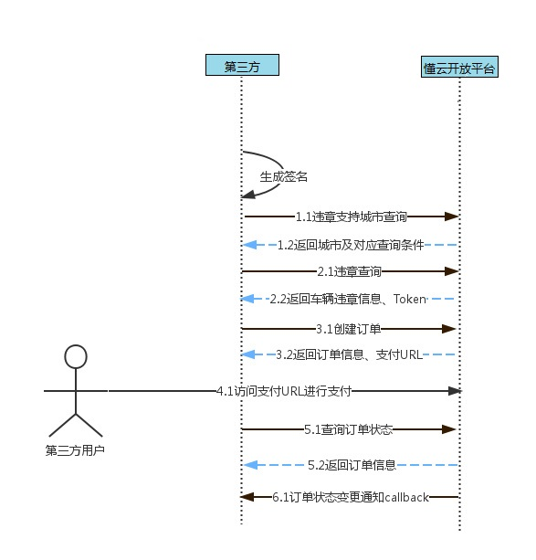
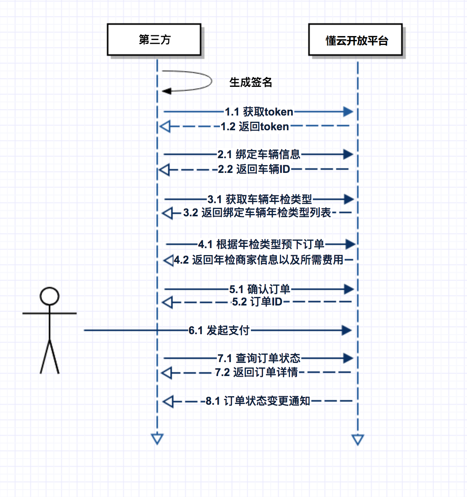

# 懂云违章数据服务官方文档

## 快速入门指南

### 账号开通申请

>*账号开通及其他问题请联系懂小姐：* 邮箱：bd@docloud.vip QQ：978174573

### 联调环境说明

*暂不提供测试环境*
* 正式地址：https://openapi.docloud.vip

###接口请求说明

- 字符集编码：UTF-8
- Content-type：application/json;charset=utf-8

### 异常返回内容

```json
{
    "success": false,
    "errCode": 1000,
    "message": "系统异常"
}
```

### 公共参数

*所有接口请求，不管GET还是POST请求都需要在URL后跟上以下参数：*

|名称|类型|必传|描述|
|---|---|---|---|
|app_key|string|是|平台分配给第三方的账号|
|timestamp|long|是|请求的UTC时间戳，单位毫秒|
|sign|string|是|签名|

示例：
```bash
curl https://openapi.docloud.vip/sign/test?city=1&name=demo&app_key=TEST&timestamp=1472031147156&sign=0222A1A6CBB75EE48F3746CC17982127
```

### 签名规则

接入方需要先通过邮件申请app_key和app_secret，然后每次接口请求需要进行签名。

具体签名算法如下：

假设URL为https://openapi.docloud.vip/amap/city/condition?name=jack&city=1&citz=3
1. 获取URL里的?后面的参数，得到urlParam：name=jack&city=1&citz=3
2. 后面的参数按key升序重排再重新以&拼装，得到urlParam：city=1&citz=3&name=jack
3. 执行以下加密过程（reuqestBody为POST请求体，GET请求为空）：
UpperCase(md5Hex(reverse(app_key+app_secret+urlParam+requestBody)))
[手把手一步一步调签名点我](http://openapi.docloud.vip/signDemo/index.php "手把手一步一步调签名点我")

签名验证接口：

```
https://openapi.docloud.vip/sign/test?app_key=TEST&timestamp=1472182371254&sign=FD946BC73EED770270114B1118CD8ACB
```

参照上面的地址，自行设置参数把sign替换成根据签名算法生成的签名进行验证，若成功则返回：
```json
{
    "success": true,
    "data": {
        "requestBody": "{\"data\":\"顺便测试中文乱码\"}",
        "urlParam": "app_key=TEST&timestamp=1472182371254&sign=FD946BC73EED770270114B1118CD8ACB"
    }
}
```

JAVA代码参考：

```java
import org.apache.commons.codec.digest.DigestUtils;
import org.apache.commons.lang3.StringUtils;

import java.util.*;

public class SignUtil {

	public static void main(String[] args) {
		String url = "http://localhost:8080/open/sign/test?city=123&name=xxx&app_key=TEST&timestamp=";
		url += new Date().getTime();
		System.out.println(url);
		String sign = null;
		try {
			String requestBody = "";//"{\"data\":\"123\"}"; // request请求体
			sign = createSign("TEST", "TEST", url, requestBody);
		} catch (Exception e) {
			e.printStackTrace();
		}
		System.out.println(sign);
		System.out.println(url + "&sign=" + sign);
	}

	public static String sortUrlParam(String url) {
		List<String& paramList = new ArrayList<&();
		url = url.substring(url.indexOf("?") + 1, url.length());
		String[] urlParam = url.split("&");
		for (String param : urlParam) {
			paramList.add(param);
		}
		Collections.sort(paramList, new Comparator<String&() {
			@Override
			public int compare(String arg0, String arg1) {
				return arg0.split("=")[0].compareTo(arg1.split("=")[0]);
			}
		});
		url = StringUtils.join(paramList, "&");
		return url;
	}

	public static String sign(String appKey, String appSecret, String requestParam)
			throws Exception {
		StringBuilder sb = new StringBuilder(appKey).append(appSecret).append(requestParam);
		String sign = StringUtils.reverse(sb.toString());
		sign = DigestUtils.md5Hex(sign);
		sign = sign.toUpperCase();
		return sign;
	}

	public static String createSign(String appKey, String appSecret, String requestUrl, String requestBody)
			throws Exception {
		String requestParam = sortUrlParam(requestUrl);
		if (StringUtils.isNotBlank(requestBody)) {
			requestParam = requestParam + requestBody;
		}
		String sign = sign(appKey, appSecret, requestParam);

		return sign;
	}

	public static String createSign(String appKey, String appSecret, String requestUrl) throws Exception {
		return createSign(appKey, appSecret, requestUrl, null);
	}

}

```

PHP代码参考：(注意php文件的编码设置为utf-8，GBK编码的使用strrevcn并传入编码参数为"UTF-8")
```php
<?php
class DongYunModel{

    const TEST_URL = "https://int-openapi.docloud.vip";
    const FORMAL_URL = "http://openapi.docloud.vip";
    const IS_TEST = true;
    const APP_KEY = 'TEST';
    const APP_SECRET = 'TEST';

    static private $domain = null;

    public function __construct(){
        self::$domain = self::IS_TEST ? self::TEST_URL : self::FORMAL_URL;
    }

    public function __destruct(){
        self::$domain = null;
    }


    /**
     * @parameter   void
     * @name        getCityList
     * @function    获取支持查询城市列表
     * @return      array
     */
    public function getCityList(){
        $url = self::initUrl(self::$domain . '/violation/condition');
        list($ret, $err) = self::httpQuery($url);
        if($err !== false){
            return array(array(), false, 'query error');
        }
        $ret = json_decode($ret, true);
        if($ret['success'] == false){
            return array($ret, false, 'response error');
        }
        return array($ret['data'], true, 'success');
    }


    /**
     * @parameter   array (
     *                       "number"           车牌号
     *                       "vin"              全车架号
     *                       "engine"           全发动机号
     *                    )
     * @name        queryViolations
     * @function    查违章
     * @return      array
     */
    public function queryViolations($data){
        $url = self::$domain . '/violation/query';
        $post_data = json_encode(array(
            "plateNumber" =& $data['number'],
            "vin" =& $data['vin'],
            "engineNo" =& $data['engine'],
        ));
        $url = self::initUrl($url, $post_data);
        list($ret, $err) =  self::httpQuery($url, $post_data);
        if($err !== false){
            return array(array(), false, 'query error');
        }
        $ret = json_decode($ret, true);
        if($ret['success'] == false){
            return array($ret, false, 'response error');
        }
        return array($ret, true, 'success');
    }

    /**
     * @parameter   array (
     *                       "number"           车牌号
     *                       "vin"              全车架号
     *                       "engine"           全发动机号
     *                       "mobile"           手机号码
     *                    )
     * @name        queryViolations
     * @function    查违章及费用
     * @return      array
     */
    public function queryViolationsFee($data){
        $url = self::$domain . '/violation/query';
        $post_data = json_encode(array(
            "plateNumber" =& $data['number'],
            "vin" =& $data['vin'],
            "engineNo" =& $data['engine'],
            "phone" =& $data['mobile'],
			"needFee" =& true
        ));
        $url = self::initUrl($url, $post_data);
        list($ret, $err) =  self::httpQuery($url, $post_data);
        if($err !== false){
            return array(array(), false, 'query error');
        }
        $ret = json_decode($ret, true);
        if($ret['success'] == false){
            return array($ret, false, 'response error');
        }
        return array($ret['data'], true, 'success');
    }


    /**
     * @parameter   $url
     *              $post_data
     * @name        initUrl
     * @function    初始化url
     * @return      string
     */
    static private function initUrl($url, $post_data = ''){
        list($url, $urlParam) = explode('?', $url);
        $urlParam .= (empty($urlParam) ? '' : '&') . http_build_query(array(
                'app_key' =& self::APP_KEY,
                'timestamp' =& time()
            ));
        $param = explode('&', $urlParam);
        sort($param);
        $urlParam = implode("&", $param);
        $sign = strtoupper(md5(strrev(self::APP_KEY . self::APP_SECRET . $urlParam . $post_data)));
        $url = $url . "?" . $urlParam . '&sign=' . $sign;
        return $url;
    }

    // 功能: http查询
    // 函数: httpQuery($http_get_path, $post_string)
    //    @      $http_get_path      GET地址
    //    @      $post_string        post field 域内容
   static private function httpQuery($http_url, $post = "", $headers = array('Content-type: application/json;charset="utf-8"'), $options = array()){
        // 创建curl地址(目前没有使用https的服务器)

        // 初始化curl
        $curl = curl_init();
        // 不直接显示抓取结果
        curl_setopt($curl, CURLOPT_RETURNTRANSFER, true);
        // 设置url
        curl_setopt($curl, CURLOPT_URL, $http_url);
        // 设置http头部
        if( !empty($headers) ){
            curl_setopt($curl, CURLOPT_HTTPHEADER, $headers);
        }

       !empty($options) && curl_setopt_array($curl, $options);

        // 设置body信息
        if(!empty($post)){
            curl_setopt($curl, CURLOPT_POST, 1);
            curl_setopt($curl, CURLOPT_POSTFIELDS, $post);
        }
        // 超时时间
        curl_setopt($curl, CURLOPT_TIMEOUT, 15);
        $response_string = curl_exec($curl);

        $curl_error = false;
        if(false === $response_string){
            $curl_error = curl_error($curl);
        }
        curl_close($curl);

        // 返回 (响应信息、错误信息)
        return array($response_string, $curl_error);
    }

}
```

## 数据字典

### 车辆类型

|数值|描述|
|---|---|
|01|大型汽车|
|02|小型汽车|
|51|大型新能源汽车|
|52|小型新能源汽车|
|15|挂车|

### 违章处理状态

|数值|描述|
|---|---|
|1|未处理|
|2|处理中|
|3|已处理|
|4|不支持处理|

### 订单状态字典

|数值|描述|
|---|---|
|1|订单已创建|
|2|订单已支付|
|3|订单已完成|
|4|订单已关闭|

### 错误码字典

|数值|描述|
|---|---|
|1000|	系统异常|
|1001|	请求参数错误，具体请查看返回内容|
|1002|	上传文件大小超过限制|
|1003|	违章查询请求参数错误，具体请查看返回内容|
|1004|	APPID 不存在|
|1005|	签名无效|
|1006|	查询城市不能为空|
|1007|	网络异常，请返回违章页面重试|
|1008|	违章已处理完成，不能重复下单|
|1009|	app_key为空|
|1010|	无权访问此接口|
|1011|	API接口调用超出授权次数|
|1012|	API接口调用太过频繁|
|1013|	查询失败|
|1014|	查询中,请稍后再试|
|1015|	官方接口维护中，维护时间：2050-01-01 08:00 至 2050-01-01 12:00|
|1086|  系统维护，暂不支持查询|
|1016|	该接口不支持异地车牌查询|
|1020|	车辆信息错误|
|1021|	发动机号错误|
|1022|	车架号错误|
|1030|	车牌格式错误|
|1031|	该城市暂未开通|
|1032|	车架号或发动机号{位数}错误|
|1035|	请输入正确的11位手机号码|
|1036|	同一车牌号不能重复添加|
|1037|	用户车辆不能大于3辆|
|1101|	无效的 TOKEN|
|1102|	用户与订单不匹配|
|1103|	抱歉，处理城市暂不支持违章代缴|
|1104|	违章已在处理中，不能重复下单|
|1105|	订单金额有误|
|1106|	无待处理违章|
|1107|	违章信息校验失败，可能违章CODE错误|
|1108|	违章已处理完成，不能重复下单|
|1109|	挂账支付失败|
|1110|	TOKEN为空|
|1117|	提交的订单号已存在|
|1120|	订单已支付|
|1121|	订单已失效|
|1141|	添加失败|
|1142|	操作失败|

## 违章查缴

### 违章查缴接入指南

#### 合作流程
平台提供【违章查询】和【违章查缴】两种合作模式，违章查询只查询违章数据，违章查缴能查询违章及代办费并在平台处理违章（只支持非扣分违章的代办）。

违章数据只包含用户未处理的违章以及在平台平台代办过的已处理的违章。

1. 调用【违章查询条件】接口查询平台支持哪些城市以及每个城市需要的查询条件
2. 根据查询条件要求传入查询参数调用【违章查询】接口查询违章信息
3. 合作方根据用户的选择后者默认全选，传入选中违章的编号violation-code，调用【创建订单】接口得到订单ID。如果对接方式为自扣分，则需要先调用【自扣分下单校验】判断是否支持自扣分办理，再调用【创建代缴订单（自扣分）】进行自扣分违章的下单。
4. 调用【订单详情】接口查询订单状态及详情，如果支付模式约定为在平台在线支付，则根据返回的支付链接跳转让用户支付。如果支付模式为挂账，则调用订单详情获取订单状态即可，无需支付（创建订单和挂账支付是两步，存在一定延迟）
5. 用户支付或者挂账支付成功后，平台会根据合作方预先填写的订单状态回调URL进行回调。
6. 订单处理完成或订单处理失败，平台会根据合作方预先填写的订单状态回调URL进行回调。
7. 若支付方式为挂账，需按月销账或充值。

#### 注意事项
1. 手机号必须为真实信息，若发现伪造，可能会取消合作。
2. 查询接口若没有传入手机号，下单接口必须同时传入手机号、车牌号、发动机号、车架号。
3. 浙江接口查询必须传入手机号，否则会查询失败。
4. 如果查询接口无法传入手机号，可以在创建订单前先调用【获取token】接口，token是创建订单和查询订单的必要参数。

#### 接口交互



### API列表

#### 获取token

* 请求地址：/violation/assign/token
* 请求方式：POST

接口说明：如果用户在查询接口没有输入手机号，则可以通过此接口获得token，调用此接口不会产生计费。

请求参数：

|参数名|类型|必填|描述|
|---|---|---|---|
|phone|string|是|手机号码，注意：一个手机号最多查3辆车！另外，必须传递真实号码。|
|plateNumber|string|是|车牌号|
|vin|string|否|车架号，长度要求参考各城市要求，从【违章查询条件】接口获取|
|engineNo|string|否|发动机号，长度要求参考各城市要求，从【违章查询条件】接口获取|

请求示例：

```json
{
    "phone": "10112341111",
    "plateNumber": "浙A778QZ",
    "engineNo": "0018835448DT",
    "vin": "SALMN1H46CA385572",
}
```

返回参数：

|参数名	|类型|	描述|
|---|---|---|
|token	|string|用户身份标识|

返回示例：

```json
{
    "success": true,
    "data": {
        "token": "8045402120367843"
    }
}
```

#### 支持城市及条件

* 请求地址：/violation/condition/all/1.0 
* 请求方式：GET  

*接口说明：*
获取当前支持城市及对应城市的查询条件，支撑城市平台养车支持的并且对合作方开放的城市，开放哪些城市合作方可以和平台商务人员确认。

请求参数：
无

返回参数：

|参数名|类型|描述|
|---|---|---|
|province|string|省份名称，“浙江省”|
|list|object|	下属城市列表|
|city|string|城市名称，“杭州市”|
|cityPrefix|string|城市对应的车牌前缀，“浙A”|
|vinLength|string|所需车架号位数， -1 为全位， 0 不需要，其它数字表示截取后面多少位|
|engineNoLength|string|所需发动机号位数， -1 为全位， 0 不需要，其它数字表示截取后面多少位|
|carTypes|object|支持的车辆类型数组，车辆类型定义参考数据字典|

返回示例：

```json
{
    "success": true,
    "data": [
        {
            "province":"北京市",
            "list":[
                {
                    "city": "北京市",
                    "engineNoLength": "-1",
                    "vinLength": "0",
					"cityPrefix": "京",
					"carTypes": ["01","02"]
                }
            ]
        },
        {
            "province":"河北省",
            "list":[
                {
                    "city": "石家庄市",
                    "engineNoLength": "4",
                    "vinLength": "0",
					"cityPrefix": "冀A"
                },
                {
                    "city": "唐山市",
                    "engineNoLength": "4",
                    "vinLength": "0",
					"cityPrefix": "冀B"
                },
                {
                    "city": "邯郸市",
                    "engineNoLength": "4",
                    "vinLength": "0",
					"cityPrefix": "冀D"
                },
                {
                    "city": "邢台市",
                    "engineNoLength": "4",
                    "vinLength": "0",
					"cityPrefix": "冀E"
                }
            ]
        }
    ]
}
```

#### 查询违章及费用

* 请求地址：/violation/query/1.0
* 请求方式：POST

接口说明：
关于查询城市，指查询方希望以哪个城市的查询结果为主，因为各地法规不一致以及接口不同步问题，不同城市返回的数据不完全一致。
同一辆车同一时刻只能允许一次查询，其它的并发查询请求会返回“查询中，请稍后再试”，此逻辑用于防止用户恶意刷新，建议接入商也可做一下这个限制。

请求参数：

|参数名|类型|必填|描述|
|---|---|---|---|
|carType|string|否|车辆类型：01大型车 02小型车（默认）|
|plateNumber|string|是|车牌号|
|vin|string|否|车架号，具体是否必填及长度要求参考各城市要求，从【违章查询条件】接口获取|
|engineNo|string|否|发动机号，具体是否必填及长度要求参考各城市要求，从【违章查询条件】接口获取|
|phone|string|否|手机号码，根据合作要求不同渠道要求不同，注意：一个手机号最多查3辆车！另外，必须传递真实号码。|
|city|string|否|查询哪个城市的数据，如果不传则取车牌所在城市数据，传了不会再取车牌所在地数据|
|needFee|boolean|否|是否需要返回服务费用，默认false,需要返回服务费则传入true；但是合作类型如果只是查询，则传入true也不会返回。如果不传，罚款扣分标准不以代办城市为标准。|
|deductSelf|boolean|否|是否自扣分，默认false|

请求示例：

```json
{
    "engineNo": "0018835448DT",
    "phone": "10112341111",
    "plateNumber": "浙A778QZ",
    "vin": "SALMN1H46CA385572",
	"city": "杭州市"
}
```

返回参数：

|参数名	|类型|	描述|
|---|---|---|
|token	|string|用户身份标识|
|totalFine|	string|	未处理违章总罚款|
|totalPoints|	int|	未处理违章总扣分|
|untreated|	int|	未处理违章条数|
|violations|object|	违章明细|
|code|	string|	违章编码,唯一，非违章条例码|
|time|	string|	违章时间|
|fine	|string|	罚款金额|
|address|	string|	违章地址|
|reason	|string|	违章处理原因|
|point|	int|	违章扣分|
|violationCity|	string|	违章发生城市，可能为空|
|province|	string|	罚款标准省份|
|city|	string|	罚款标准城市|
|serviceFee|	string|	服务费|
|canSelect|	int	|能否勾选办理：0不可勾选, 1可勾选。|
|processStatus	|int	|违章处理状态：1：未处理，2：处理中，3：已处理|
|paymentStatus|int|违章缴费状态 不返回表示无法获取该信息，1-未缴费 2-已缴费|
|markFee|string|代扣分费用|
|needTravelLicense|int|是否需要上传行驶证：0-不需要 1-需要，该字段为空则默认不需要|
|processType|int|违章处理类型(默认不返回，如需此字段请与小卡品牌工作人员沟通) 0-0分未处理未交款不可代办,1-0分未处理未交款可代办,4-0分已处理未交款不可代办,5-0分已处理未交款可代办,6-0分已处理已交款不可代办,8-扣分未处理未交款不可代办,9-扣分未处理未交款可代办,12-扣分已处理未交款不可代办,13-扣分已处理未交款可代办,14-扣分已处理已交款不可代办|
|violationNum|string|违章官方编码(默认不返回，如需此字段请与小卡品牌工作人员沟通)|
|violationWritNo|string|违章文书号(默认不返回，如需此字段请与小卡品牌工作人员沟通)|
|organName|string|采集机关名称(默认不返回，如需此字段请与小卡品牌工作人员沟通)|

返回示例：

```json
{
    "success": true,
    "data": {
        "token": "8045402120367843",
        "totalFine": "200",
        "totalPoints": 6,
        "untreated": 3,
        "violations": [{
                "code": "1232-D1",
                "time": "2016-06-06 12:32:38",
                "fine": "200.00",
                "address": "文二西路口",
                "reason": "您在 xx 路违反了交通规则",
                "point": 6,
                "province": "浙江省",
                "city": "杭州市",
                "serviceFee": "23.00",
                "canSelect": 1,
                "processStatus": 1,
				"paymentStatus": 1,
				"organName": "上海市公安局闵行分局交通警察支队综合管理大队"
        }]
    }
}
```

#### 创建代缴订单

* 请求地址：/violation/create/order
* 请求方式：POST

接口说明：根据违章查询的参数来创建订单，支持批量创建，如希望交易流程尽量简单，优先选择一笔订单对应一条违章的对接方式。

请求参数：

|参数名	|类型|必填|	描述|
|---|---|---|---|
|violationCodes|array-string|是|	违章记录唯一编码，查询出违章的每一个 code|
|totalPrice|	string|是|	代办总金额（罚款金额+服务费）|
|outOrderNo|	string|是|	第三方订单流水号（重复提交会报错）|
|token|	string|是|	用户身份标识|
|carType|string|否|车辆类型：01大型车 02小型车（默认）|
|lng	|float|否|	下单时用户所在地经度|
|lat	|float|否|	下单时用户所在地维度|
```json
{
    "token": "9238SD8F732",
    "violationCodes": ["32-DS", "32-DS"],
    "totalPrice": "500",
    "outOrderNo": 32343242,
    "lng": 132.123213,
    "lat": 24.325185
}
```

返回参数：

|参数名	|类型|	描述|
|---|---|---|
|orderId	|int	|订单编号|

```json
{
    "success": true,
    "data": {
        "orderId": 1234566
    }
}
```

#### 查询订单状态

* 请求地址：/violation/order/status
* 请求方式：GET

接口说明：根据订单编号查询对应的订单状态。

请求参数：

|参数名	|类型|必填|	描述|
|---|---|---|---|
|token|	string|是|	用户身份标识|
|orderId|	int	|是|订单编号|

返回参数：

|参数名	|类型|	描述|
|---|---|---|
|orderId|	int|	订单编号|
|orderStatus|	int|订单状态|
|modifyTime|	string|	状态变更时间|
|violations|object|	违章明细|
|code|	string|	违章编码,唯一，非违章条例码|
|processStatus	|int	|违章处理状态：1：未处理，2：处理中，3：已处理，4：不支持处理|

```json
{
    "success": true,
    "data": {
        {
            "orderId": 1321321,
            "orderStatus": "1",
            "modifyTime": "2016-06-06 12:32:38",
			"violations": [{
					"code": "1232-D1",
					"process_status": 1
			}]
        }
    }
}
```

#### 查询代缴订单详情

* 请求地址：/violation/order/detail
* 请求方式：GET

接口说明：根据平台返回的订单ID查询订单详情

请求参数：

|参数名	|类型|必填|	描述|
|---|---|---|---|
|token|	string|是|	用户身份标识|
|orderId|	int|是|	订单编号|

返回参数：

|参数名	|类型|	描述|
|---|---|---|
|orderId|int|订单编号|
|orderStatus|	int|订单状态：1-已创建，2-已支付，3-已完成，4-已关闭|
|orderCreateTime|	string|	订单创建时间|
|orderPayTime|	string|	订单支付时间|
|orderCloseTime|	string|	订单关闭时间，只有关闭的订单才返回|
|orderPrice|decimal(10,2)|订单金额|
|payUrl	|string|第三方支付跳转链接|
|plateNumber|string|车牌号码|
|cancelReason|string|取消原因(当且仅当订单被取消时返回)|
|violations|object|	违章明细|
|code|	string|	违章编码,唯一，非违章条例码|
|time|	string|	违章时间|
|fine	|string|	罚款金额|
|address|	string|	违章地址|
|reason	|string|	违章处理原因|
|point|	int|	违章扣分|
|province|	string|	省份|
|city|	string|	城市|
|serviceFee|	string|	服务费|

```json
{
    "success": true,
    "data": {
        "orderId": 1234566,
        "orderStatus": "1",
        "orderCreateTime": "2016-06-06 12:32:38",
		"orderPayTime": "2016-06-06 12:32:38",
		"orderCloseTime": "2016-06-06 12:32:38",
		"orderPrice": 520.00,
        "payUrl": "https://openapi.docloud.vip/alipay",
		"plateNumber": "浙A66688",
        "violations": [{
                "code": "1232-D1",
                "time": "2016-06-06 12:32:38",
                "fine": "200.00",
                "address": "文二西路口",
                "reason": "您在 xx 路违反了交通规则",
                "point": 6,
                "province": "浙江省",
                "city": "杭州市",
                "serviceFee": "23.00"
        }]
    }
}
```

#### 订单状态变更通知

* 请求地址： 回调URL由接入方提供
* 请求方式： POST

安全加密： 回调时会根据分配给合作方的app_key和app_secret按照【签名规则】生成sign并附到回调URL上，如：http://xxx.xxx.com/api/changeStatus?app_key=C3AD3OMBO5W3JTB0&timestamp=1490769858578&sign=A0BB181E6899A9E451A8900ECFF72AA3 合作方按照签名规则校验sign是否合法来确认是我方回调的合法请求。

接口说明：

订单状态发生变更时会调用**回调URL**通知第三方

通知状态变更场景：支付成功、订单完成、关闭订单。

部分完成的情况说明：当订单状态为“订单已完成”时，如果refundMoney不为空，表示存在部分退款。

|参数名	|类型|	描述|
|---|---|---|
|orderId|	int|	订单编号|
|orderStatus|	int|订单状态|
|orderStatusTime|	string|	状态变更时间|
|refundMoney|double|退款金额|
|cancelReason|string|取消原因(当且仅当订单被取消时返回)|
|violations|object|	违章明细|
|code|	string|	违章编码,唯一，非违章条例码|
|processStatus	|int	|违章处理状态：1：未处理，2：处理中，3：已处理|

```json
{
    "success": true,
    "data": {
        "orderId": 1321321,
        "orderStatus": 1,
        "orderStatusTime": "2016-06-06 12:32:38",
		"refundMoney" : 200.00,
		"violations": [{
				"code": "1232-D1",
				"processStatus": 1
		}]
    }
}
```

若接收方处理成功则返回(必须返回)：
```json
{
    "success": true
 }
```

#### 上传行驶证

* 请求地址：/violation/upload/material
* 请求方式：POST

接口说明：上传行驶证照片，目前主要用于办理扣分违章，单张图片大小不得超过500KB，支持jpg、png、bmp格式。

请求参数：

|参数名	|类型|必填|	描述|
|---|---|---|---|
|travelLicenseImg|string|是|	行驶证正页图片(base64编码)|
|travelLicenseImgBg|	string|是|	行驶证副页图片(base64编码)|
|token|	string|是|	用户身份标识|
```json
{
    "token": "9238SD8F732",
    "travelLicenseImg": "5FYUGIO8VUIB9VIVOHH",
    "travelLicenseImgBg": "90fefwGUIGCU589VH"
}
```

返回参数：

|参数名	|类型|	描述|
|---|---|---|
|data	|boolean	|上传结果|

```json
{
    "success": true,
    "data": true
}
```

#### 直通车查询报价

* 请求地址：/violation/price/query
* 请求方式：POST

接口说明：
如接入方条件允许，建议传入用户唯一标示，如第三方用户id、手机号等

请求参数：

|参数名|类型|必填|描述|
|---|---|---|---|
|plateNumber|string|是|车牌号|
|carType|string|否|车辆类型：01大型车 02小型车（默认）|
|vin|string|否|车架号，长度要求参考各城市要求，从【违章查询条件】接口获取|
|engineNo|string|否|发动机号，长度要求参考各城市要求，从【违章查询条件】接口获取|
|phone|string|是|手机号|
|remark|string|否|备注信息|
|items|List|是|违章信息|
|item.violationCity|string|是|违章城市|
|item.violationTime|string|是|违章时间，格式为yyyy-MM-dd HH:mm:ss|
|item.violationLocation|string|是|违章地点|
|item.violationCode|string|是|违章代码|
|item.violationFine|int|是|违章罚款|
|item.violationMark|int|是|违章扣分|
|item.violationNum|string|否|违章处罚单号|
|item.violationReason|string|是|违章原因|


请求示例：

```json
{
    "engineNo": "0018835448DT",
    "phone": "10112341111",
    "plateNumber": "浙A778QZ",
    "vin": "SALMN1H46CA385572",
	"items": [
	{
	"violationCity":"杭州市",
	"violationTime":"2017-01-02 14:00:23",
	"violationLocation":"西溪科创园",
	"violationCode":"88-9020",
	"violationFine":0,
	"violationMark":200,
	"violationNum":"2892002719000",
	"violationReason":"违反信号灯"
	}
	]
}
```

返回参数：

|参数名	|类型|	描述|
|---|---|---|
|token	|string|用户身份标识|
|totalFine|	string|	违章总罚款|
|totalPoints|	string|	违章总分数|
|untreated|	int|	违章条数|
|violations|object|	违章明细|
|code|	string|	违章编码,唯一，非违章条例码|
|time|	string|	违章时间|
|fine	|string|	罚款金额|
|address|	string|	违章地址|
|reason	|string|	违章处理原因|
|point|	int|	违章扣分|
|province|	string|	省份|
|city|	string|	城市|
|serviceFee|	string|	服务费|
|canSelect|	int	|能否勾选办理：0不可勾选, 1可勾选。|
|processStatus	|int	|违章处理状态：1：未处理，2：处理中，3：已处理，4：不支持处理|
|markFee|string|代扣分费用|
|needTravelLicense|int|是否需要上传行驶证：0-不需要 1-需要，该字段为空则默认不需要|

返回示例：

```json
{
    "success": true,
    "data": {
        "token": "8045402120367843",
        "totalFine": "200",
        "totalPoints": 6,
        "untreated": 3,
        "violations": [{
                "code": "1232-D1",
                "time": "2016-06-06 12:32:38",
                "fine": "200.00",
                "address": "文二西路口",
                "reason": "您在 xx 路违反了交通规则",
                "point": 6,
                "province": "浙江省",
                "city": "杭州市",
                "serviceFee": "23.00",
                "canSelect": 1,
                "processStatus": 1
        }]
    }
}
```

#### 自扣分下单校验

* 请求地址：/violation/deduct/self/valid
* 请求方式：POST

接口说明：自扣分违章下单校验(如是否私家车、是否本人本车等)

请求参数：

|参数名	|类型|必填|	描述|
|---|---|---|---|
|token|	string|是|	用户身份标识|
|driveNum|	string|是|	驾驶证号|
|fileNum|	string|是|	档案编号|
|carType|string|否|车辆类型：01大型车 02小型车（默认）|
```json
{
    "token": "9238SD8F732",
	"driveNum":"330101198805060708",
	"fileNum":"29002402420"
}
```

返回参数：

|参数名	|类型|	描述|
|---|---|---|
|result	|boolean	|是否可自扣分下单|

```json
{
    "success": true,
    "data": {
		"result":true
	}
}
```

#### 创建代缴订单(自扣分)

* 请求地址：/violation/deduct/self/create/order
* 请求方式：POST

接口说明：自扣分违章下单

请求参数：

|参数名	|类型|必填|	描述|
|---|---|---|---|
|violationCodes|array-string|是|	违章记录唯一编码，查询出违章的每一个 code|
|totalPrice|	string|是|	代办总金额（罚款金额+服务费）|
|outOrderNo|	string|是|	第三方订单流水号|
|token|	string|是|	用户身份标识|
|driveNum|	string|是|	驾驶证号|
|fileNum|	string|是|	档案编号|
|carType|string|否|车辆类型：01大型车 02小型车（默认）|
|lng	|float|否|	下单时用户所在地经度|
|lat	|float|否|	下单时用户所在地维度|
```json
{
    "token": "9238SD8F732",
    "violationCodes": ["32-DS", "32-DS"],
    "totalPrice": "500",
    "outOrderNo": "32343242",
	"driveNum":"330101198805060708",
	"fileNum":"29002402420",
    "lng": 122.123213,
    "lat": 24.325185
}
```

返回参数：

|参数名	|类型|	描述|
|---|---|---|
|orderId	|int	|订单编号|

```json
{
    "success": true,
    "data": {
        "orderId": 1234566
    }
}
```

## 查询违章条数

### API列表

#### 支持城市列表

* 请求地址：/violation/amount/cities
* 请求方式：GET

接口说明：
获取当前支持城市及对应城市的查询条件，支撑城市平台养车支持的并且对合作方开放的城市，开放哪些城市合作方可以和平台商务人员确认。

请求参数：
无

返回参数：

|参数名|类型|描述|
|---|---|---|
|province|string|省份名称，“浙江省”|
|prefix|string|省份对应的车牌前缀，“浙”|
|list|object|	下属城市列表|
|city|string|城市名称，“杭州市”|
|prefix|string|城市对应的车牌前缀，“浙A”|

返回示例：

```json
{
    "success": true,
    "data": [
        {
            "province": "北京市",
			"prefix": "京"
        },
		{
            "province": "浙江市",
			"prefix": "浙",
            "list":[
                {
                    "city": "杭州市",
					"cityPrefix": "浙A"
                },
				{
                    "city": "宁波市",
					"cityPrefix": "浙B"
                }
            ]
        }
    ]
}
```

#### 查询违章条数

* 请求地址：/violation/amount/query
* 请求方式：POST

接口说明：查询车辆所在地接口返回的违章条数

请求参数：

|参数名|类型|必填|描述|
|---|---|---|---|
|plateNumber|string|是|车牌号|
|engineNo|string|是|发动机号后六位|
|carType|int|否|默认小型汽车，2小型车 1大型车 15挂车|

请求示例：

```json
{
    "engineNo": "5448DT",
    "plateNumber": "浙A778QZ"
}
```

返回参数：

|参数名	|类型|	描述|
|---|---|---|
|total|int|未处理总条数，上限10，无违章返回0|
|otherProvince|	int|	外省未处理违章条数，无违章返回0|
|localProvince|	int|	本省未处理违章条数，无违章返回0|
|localCity|	int|	本市未处理违章条数，无违章返回0|

返回示例：

```json
{
    "success": true,
    "data": {
        "total": 10,
        "otherProvince": 3,
        "localProvince": 3,
        "localCity": 4
    }
}
```

## 车辆违章监控

### API列表

#### 添加或覆盖监控车辆信息

* 请求地址：/monitor/car/add
* 请求方式：POST

接口说明：
添加新的违章监控车辆信息，如车辆已存在，则用新的信息覆盖旧的车辆信息

请求参数：

|参数名|类型|必填|描述|
|---|---|---|---|
|carType|string|是|车辆类型：01大型车 02小型车|
|plateNumber|string|是|车牌号|
|vin|string|是|车架号|
|engineNo|string|是|发动机号|
请求示例：

```json
{
    "engineNo": "0018835448DT",
    "plateNumber": "浙A778QZ",
    "vin": "SALMN1H46CA385572",
	"carType": "02"
}
```

返回参数：

|参数名|类型|描述|
|---|---|---|
|data|boolean|结果|

返回示例：

```json
{
    "success": true,
    "data": true
}

```

*车辆信息错误（若要校验，需申请）*

```json
{
    "message":"车架号或发动机号位数错误",
    "success":false,
    "errCode":"1032"
}
```

*错误字典*

|errCode	|message|
|---|---|
|1020|	车辆信息错误|
|1021|	发动机号错误|
|1022|	车架号错误|
|1030|	车牌格式错误|
|1031|	该城市暂未开通|
|1032|	车架号或发动机号位数错误|


#### 批量添加或覆盖监控车辆

* 请求地址：/monitor/car/batchAdd
* 请求方式：POST

接口说明：
批量添加新的违章监控车辆信息，如车辆已存在，则用新的信息覆盖旧的车辆信息
一次性添加车辆信息数量不得超过50

请求参数：

|参数名|类型|必填|描述|
|---|---|---|---|
|carType|string|是|车辆类型：01大型车 02小型车|
|plateNumber|string|是|车牌号|
|vin|string|是|车架号|
|engineNo|string|是|发动机号|
请求示例：

```json
[{
    "engineNo": "0018835448DT",
    "plateNumber": "浙A778QZ",
    "vin": "SALMN1H46CA385572",
	"carType": "02"
},{
    "engineNo": "223043",
    "plateNumber": "苏C7233Q",
    "vin": "288292",
	"carType": "02"
},{
    "engineNo": "UI78Y7",
    "plateNumber": "沪C3342Y",
    "vin": "UILLIFG788998",
	"carType": "02"
},{
    "engineNo": "789222",
    "plateNumber": "皖N55677",
    "vin": "789001",
	"carType": "02"
}]
```

返回参数：

|参数名	|类型|	描述|
|---|---|---|
|data	|boolean|结果|

返回示例：

```json
{
    "success": true,
    "data": true
}
```

#### 移除监控车辆信息

* 请求地址：/monitor/car/remove
* 请求方式：POST

接口说明：
当某个车辆不再需要进行违章监控时，通过本接口进行移除，移除后车辆不再反馈违章信息。

请求参数：

|参数名|类型|必填|描述|
|---|---|---|---|
|carType|string|是|车辆类型：01大型车 02小型车|
|plateNumber|string|是|车牌号|

请求示例：

```json
{
    "plateNumber": "浙A778QZ",
	"carType": "02"
}
```

返回参数：

|参数名	|类型|	描述|
|---|---|---|
|data	|boolean|结果|

返回示例：

```json
{
    "success": true,
    "data": true
}
```

#### 批量移除监控车辆信息

* 请求地址：/monitor/car/batchRemove
* 请求方式：POST

接口说明：
批量移除违章监控车辆信息，移除后车辆不再反馈违章信息。
一次性移除车辆信息数量不得超过50

请求参数：

|参数名|类型|必填|描述|
|---|---|---|---|
|carType|string|是|车辆类型：01大型车 02小型车|
|plateNumber|string|是|车牌号|
请求示例：

```json
[{
    "plateNumber": "浙A778QZ",
	"carType": "02"
},{
    "plateNumber": "苏C7233Q",
	"carType": "02"
},{
    "plateNumber": "沪C3342Y",
	"carType": "02"
},{
    "plateNumber": "皖N55677",
	"carType": "02"
}]
```

返回参数：

|参数名	|类型|	描述|
|---|---|---|
|data	|boolean|结果|

返回示例：

```json
{
    "success": true,
    "data": true
}
```

#### 车辆违章信息变更通知

* 请求地址：回调URL由接入方提供
* 请求方式：POST

安全加密： 回调时会根据分配给合作方的app_key和app_secret按照【签名规则】生成sign并附到回调URL上，如：http://xxx.xxx.com/api/changeStatus?app_key=C3AD3OMBO5W3JTB0×tamp=1490769858578&sign=A0BB181E6899A9E451A8900ECFF72AA3 合作方按照签名规则校验sign是否合法来确认是我方回调的合法请求。

接口说明：

车辆违章信息发生变更时会调用**回调URL**发起通知。

|参数名	|类型|	描述|
|---|---|---|
|plateNumber|string|车牌号|
|items|	List|	违章列表|
|code|	string|	违章编码,唯一，非违章条例码|
|time|	string|	违章时间|
|fine	|string|	罚款金额|
|address|	string|	违章地址|
|reason	|string|	违章处理原因|
|point|	int|	违章扣分|
|violationCity|	string|	违章发生城市，可能为空|
|processStatus	|int	|违章处理状态：1：未处理，2：处理中，3：已处理，4：不支持处理|
|paymentStatus|int|违章缴费状态 不返回表示无法获取该信息，1-未缴费 2-已缴费|
|violationNum|string|违章官方编码|
|violationWritNo|string|违章文书号|
|organName|string|采集机关名称|
|serviceFee|int|	服务费（该字段需申请）|
|canSelect|	int	|能否勾选办理：0不可勾选, 1可勾选。（该字段需申请）|
|markFee|int|代扣分费用（该字段需申请）|
|needTravelLicense|int|是否需要上传行驶证：0-不需要 1-需要，该字段为空则默认不需要（该字段需申请）|

```json
{
    "success": true,
    "data": {
		"plateNumber":"浙A88888",
		"items": [{
                "code": "1232-D1",
                "time": "2016-06-06 12:32:38",
                "fine": "200.00",
                "address": "文二西路口",
                "reason": "您在 xx 路违反了交通规则",
                "point": 6,
                "violationCity": "杭州市",
                "processStatus": 1,
				"paymentStatus": 1,
				"serviceFee": 23,
                "canSelect": 1,
				"markFee": 23,
                "needTravelLicense": 0,
				"organName": "上海市公安局闵行分局交通警察支队综合管理大队"
        }]
    }
}
```

车辆信息错误返回示例：

|参数名	|类型|	描述|
|---|---|---|
|plateNumber|string|车牌号|
|message|	string|	错误信息描述|
|code|	string|	错误信息code|

```json
{
    "success":false,
    "data":{
        "plateNumber":" 浙A88888",
        "code":"1032",
        "message":"车架号或发动机号位数错误"
    }
}
```

若接收方处理成功则返回(必须返回)：
```json
{
    "success": true
 }
```

 **备注** 

- 更多返回错误代码请看首页的错误代码描述

## 年检

### 年检接入指南

#### 简要描述

- 年检接口通用请求头，在POST和GET请求头里必须携带

**参数：** 

|参数名|必选|类型|说明|
|:----    |:---|:----- |-----   |
|app_key |是  |string |合作商appKey   |
|token     |是  |string | 用户token    |

#### 合作流程

平台提供年检代办服务，支持【免检】和【预约到站上线检测】两种合作模式：

- 免检：指5座及以下、非商业运营车辆、未出重大事故、且首次注册时间在6年之内（不包含），不用到站检测，施行网上代办；
- 预约到站上线检测：指除上述的车辆，需要预约到检测站检测，支持预约服务，走绿色通道，有专人引导，办理更快捷方便；

支付环节上支持在线支付与挂账支付两种支付：

- 在线支付：每笔订单直接支付到平台养车
- 挂账支付：每笔订单统一从渠道账户中扣除或后结等形式。


**注意事项：** 

1. 为保证合作商用户的隐私，用户注册不用携带个人信息，但必须携带用户在合作商平台上的唯一识别码，具备唯一性和持久性，详细请查看【获取token】接口。
2. 用户在创建订单时，则必须携带用户的真实有效信息及联系方式。
3. 在预支付阶段，如果合作商是挂帐支付，切账户状态允许挂帐（额度充足）的情况，或者订单金额为0时， 订单直接支付成功，不会返回调取WEB支付的相关信息。

#### 接口交互




### API列表

#### 获取token

* 请求地址：/user/assign/token
* 请求方式：POST

**参数：** 

|参数名|必选|类型|说明|
|:----    |:---|:----- |-----   |
|authCode |是  |string |渠道用户唯一表示   |

 **返回示例**

```json
  {
    "success": true,
    "data": {
        "token": "NTkzTlYrZlMycmI0V05DL0QxSW1lUT08Cg"
    }
}
```

 **返回参数说明** 

|参数名|类型|说明|
|:-----  |:-----|-----                           |
|token |string   |用户token  |

 **备注** 

- 更多返回错误代码请看首页的错误代码描述

#### 获取车辆品牌列表

* 请求地址：/basedata/brand/list
* 请求方式：GET

- 不需要入参

**返回示例**

```json
  [
    {
        "brandId": 33,
        "brandName": "奥迪",
        "alphaCode": "A",
        "mark": null,
        "icon": "",
        "createTime": "",
        "isValid": null,
        "isValidStr": null,
        "autoHomeId": null
    },
    {
        "brandId": 34,
        "brandName": "阿尔法罗密欧",
        "alphaCode": "A",
        "mark": null,
        "icon": "",
        "createTime": "",
        "isValid": null,
        "isValidStr": null,
        "autoHomeId": null
    }
]
```

**返回参数说明**

|参数名|类型|说明|
|:-----  |:-----|-----|
|brandId|int|品牌ID|
|brandName|String|品牌名称|
|alphaCode|string|首字母|
|icon|string|品牌图标|

#### 获取车辆品牌列表

* 请求地址：/basedata/brand/list
* 请求方式：GET

**参数：**

|参数名|必选|类型|说明|
|-|-|-|-|
|brandId|是|int|车辆品牌ID|

 **返回示例**

```json
[
    {
        "seriesId": 650,
        "seriesName": "A1",
        "washCarType": null,
        "createTime": "",
        "mark": null,
        "brandId": null,
        "isValid": null,
        "guidePriceLow": null,
        "classify": null,
        "washType": null
    },
    {
        "seriesId": 3170,
        "seriesName": "A3",
        "washCarType": null,
        "createTime": "",
        "mark": null,
        "brandId": null,
        "isValid": null,
        "guidePriceLow": null,
        "classify": null,
        "washType": null
    },
    {
        "seriesId": 370,
        "seriesName": "A3(进口)",
        "washCarType": null,
        "createTime": "",
        "mark": null,
        "brandId": null,
        "isValid": null,
        "guidePriceLow": null,
        "classify": null,
        "washType": null
    }
]
```

 **返回参数说明** 

|参数名|类型|说明|
|- |-|-|
|seriesId|int|车系ID|
|seriesName|string|车系名称|

#### 获取车辆车型列表

* 请求地址：/basedata/model/list
* 请求方式：GET

**参数：** 

|参数名|必选|类型|说明|
|-|-|-|-|
|seriesId|是|int|车系ID|

 **返回示例**

```json
  [
    {
        "modelId": "17053",
        "modelName": "2014款 30 TFSI 豪华型",
        "tireStandard": "215/40R17",
        "backTireStandard": "215/40R17",
        "guidePrice": 28.98
    },
    {
        "modelId": "17052",
        "modelName": "2014款 30 TFSI 舒适型",
        "tireStandard": "215/45R16",
        "backTireStandard": "215/45R16",
        "guidePrice": 24.98
    },
    {
        "modelId": "17050",
        "modelName": "2014款 30 TFSI 时尚型",
        "tireStandard": "215/45R16",
        "backTireStandard": "215/45R16",
        "guidePrice": 19.98
    },
    {
        "modelId": "17051",
        "modelName": "2014款 30 TFSI 技术型",
        "tireStandard": "215/45R16",
        "backTireStandard": "215/45R16",
        "guidePrice": 22.48
    }
]
```

 **返回参数说明** 

|参数名|类型|说明|
|-|-|-|
|modelId|int|车型ID|
|modelName|string|车型名称|

#### 城市地区列表

##### 一级省市及直辖市列表接口

* 请求地址：/area/province/list
* 请求方式：GET

 **返回示例**

```json
  {
    "success": true,
    "data": [
        {
            "id": 4,
            "name": "浙江省"
        }
    ]
}
```

 **返回参数说明** 

|参数名|类型|说明|
|:-----  |:-----|-----                           |
|id |int   |一级省份ID  |
|name |String   |省份名称  |

##### 二级城市列表接口

* 请求地址：/area/city/list
* 请求方式：GET

**参数：** 

|参数名|必选|类型|说明|
|:----    |:---|:----- |-----   |
|provinceId |是  |int |一级省份ID   |

 **返回示例**

```json
  {
    "success": true,
    "data": [
        {
            "id": 1,
            "name": "杭州市",
            "provinceId": 4
        }
    ]
}
```

 **返回参数说明** 

|参数名|类型|说明|
|:-----  |:-----|-----                           |
|id |int   |地级市ID  |
|name |String   |地级市名称  |
|provinceId |int   |一级省份ID  |


##### 三级县/乡/区列表接口

* 请求地址：/area/district/list
* 请求方式：GET

**参数：** 

|参数名|必选|类型|说明|
|:----    |:---|:----- |-----   |
|cityId |是  |int |地级市ID   |

 **返回示例**

```json
  {
    "success": true,
    "data": [
        {
            "id": 1,
            "name": "上城区",
            "cityId": 1
        }
    ]
}
```

 **返回参数说明** 

|参数名|类型|说明|
|:-----  |:-----|-----                           |
|id |int   |地区ID  |
|name |String   |地区名称  |
|cityId |int   |地级市ID   |

 **备注** 

- 更多返回错误代码请看首页的错误代码描述


#### 绑定用户车辆

* 请求地址：/inspection/v2/vehicle/replace
* 请求方式：POST

**参数：** 

|参数名|必选|类型|说明|
|:----    |:---|:----- |-----   |
|carId |否  |int |车辆ID   |
|brandId |是  |int | 品牌ID    |
|seriesId |是  |int | 车系ID    |
|modelId |是  |int | 车型ID    |
|carNum |是  |string | 车牌号    |
|registerDate |是  |string | 注册时间，例"2016-09-01"    |
|carSeats |是  |string | 座位数    |
|useFor |是  |int | 用途 0:私家车，1：公车    |
|inspectionVehicleType |是  |int | 1:6座及以下车辆，10:7座及以上或面包车    |
|operationType |是  |int | 本车是运营车辆 是1 否0(默认)    |
|isAccidentCar |是  |int | 是否伤亡事故车 是1 否0(默认)    |

 **返回示例**

```json
  {
    "success":true,
    "data":{
        "carId":7951178
    }
}
```

 **返回参数说明** 

|参数名|类型|说明|
|:-----  |:-----|-----|
|carId |int   |车辆ID  |

 **备注** 

- 更多返回错误代码请看首页的错误代码描述


#### 免检

##### 免检待确认订单

* 请求地址：/inspection/v2/order/pre
* 请求方式：GET

**参数：** 

|参数名|必选|类型|说明|
|:----    |:---|:----- |-----   |
|carId |是  |int |车辆ID   |
|inspectType |是  |int |年检类型 免检为1   |
|lng |否  |string | 经度    |
|lat     |否  |string | 纬度    |

 **返回示例**

```json
 {
    "success": true,
    "data": {
        "carRegisterCityId": 94,
        "totalPrice": 1.5,
        "inspectionCityName": "宁波市",
        "carNum": "浙BCH111",
        "inspectionCityId": 94,
        "brandIcon": "",
        "carId": 2741450,
        "exemptedInspectCityMaterialList": [
            {
                "address": "",
                "text": "行驶证正副本原件",
                "message": [],
                "isPic": false
            },
            {
                "address": "",
                "text": "在保险期间内的交强险保单副本原件",
                "message": [
                    "被保险人需与行驶证上车辆所有人一致，如不一致，请到保险公司开具批单",
                    "请检查保单是否已过期，并提供有效期内的保单",
                    "若车船税额为0元，需另提供车船税发票或免税证明"
                ],
                "isPic": true
            },
            {
                "address": "",
                "text": "车主身份证正反面复印件",
                "message": [],
                "isPic": false
            },
            {
                "address": "",
                "text": "车辆违章处理完",
                "message": [],
                "isPic": false
            }
        ],
        "inspectionShopId": 21777,
        "phone": "18626880725",
        "goodsCode": "P291002",
        "carRegisterCityName": "宁波市"
    }
}
```

 **返回参数说明** 

|参数名|类型|说明|
|:-----  |:-----|-----                           |
|carRegisterCityId |int   |车辆注册城市ID |
|carRegisterCityName |string   |车辆注册城市  |
|totalPrice |double   |服务费  |
|inspectionCityId |int   |年检城市ID  |
|inspectionCityName |string   |年检城市ID |
|carNum |string   |车牌号  |
|brandIcon |string   |品牌图标  |
|carId |int   |车辆ID  |
|inspectionShopId |int   |检测站商家id  |
|phone |string   |默认用户手机号码  |
|exemptedInspectCityMaterialList |array   |免检所需材料  |

**exemptedInspectCityMaterialList说明** 

|参数名|类型|说明|
|:-----  |:-----|-----                           |
|address |string   |照片地址  |
|text |string   |所需材料  |
|message |array   |提示信息  |
|isPic |boolean   |是否有照片 |

 **备注** 

- 更多返回错误代码请看首页的错误代码描述

##### 免检订单详情

* 请求地址：/inspection/v2/order/detail
* 请求方式：GET

**参数：** 

|参数名|必选|类型|说明|
|:----    |:---|:----- |-----   |
|orderId |是  |int | 订单ID    |
|inspectType |是  |int | 免检：1    |

 **返回示例**

```json
  {
    "success":true,
    "data":{
        "orderId":7951177,
        "worderStatus":15,
        "plateNumber":"浙E456TY",
        "carBrandLogo":"",
        "inspectionCityName":"湖州市",
        "shopName":"平台免检商家-测试",
        "shopAddress":"文一西路测试地址10100010101号",
        "contactPhone":"10112341112",
        "contactName":"小哲",
        "sendEmsNumber":"",
        "userAddress":{
            "name":"嘻嘻还把",
            "phone":"15010000000",
            "province":"北京市",
            "city":"北京市",
            "county":"东城区",
            "address":"上海"
        },
        "memberPrice":1.5,
        "bonuses":0,
        "payPrice":0,
        "backEmsCompany":"",
        "backEmsNumber":"",
        "needData":[
            {
                "text":"行驶证正副本原件",
                "address":"",
                "message":[

                ],
                "pic":false
            },
            {
                "text":"在保险期间内的交强险保单副本原件",
                "address":"https://store.ddyc.com/res/xkcdn/images/policy-company.png",
                "message":[
                    "被保险人需与行驶证上车辆所有人一致，如不一致，请到保险公司开具批单",
                    "请检查保单是否已过期，并提供有效期内的保单",
                    "若车船税额为0元，需另提供车船税发票或免税证明"
                ],
                "pic":true
            },
            {
                "text":"车辆违章处理完",
                "address":"",
                "message":[

                ],
                "pic":false
            },
            {
                "text":"单位车辆年检委托书加盖公章",
                "address":"https://store.ddyc.com/res/xkcdn/images/letter.png",
                "message":[
                    "公章为车辆归属公司的公章，其它信息不需填写"
                ],
                "pic":true
            },
            {
                "text":"公司营业执照复印件加盖公章",
                "address":"https://store.ddyc.com/res/xkcdn/images/business-license.png",
                "message":[
                    "复印件需该车辆归属地公司的公章",
                    "需在有效期内"
                ],
                "pic":true
            }
        ]
    }
}


```

 **返回参数说明** 

|参数名|类型|说明|
|:-----  |:-----|-----                           |
|orderId |int   |订单id  |
|worderStatus |int   |订单状态  |
|plateNumber |string   |车牌号  |
|carBrandLogo |string   |品牌LOGO  |
|inspectionCityName |string   |年检城市  |
|shopName |string   |检查测站名称  |
|shopAddress |string   |检测站地址  |
|contactPhone |string   |商家联系电话  |
|contactName |string   |商家姓名  |
|userAddress |object   |回寄地址  |
|memberPrice |double   |检测费用  |
|payPrice |double   |实付金额  |
|backEmsCompany |string   |回寄物流公司  |
|backEmsNumber |string   |回寄物流单号  |
|needData |Array   |所需材料  |

**needData** 

|参数名|类型|说明|
|:-----  |:-----|-----                           |
|address |string   |照片地址  |
|text |int   |所需材料  |
|message |array   |提示信息  |
|isPic |boolean   |是否有照片 |

**worderStatus** 

|参数名|订单状态|
|:-----  |:-----|
| 10|   已创建待支付|
|15 |  待取件   |
|20 | 送件中   |
|25 | 办理中   |
|30 | 办理完成-待取件   |
|35 | 办理完成-送件中   |
|50 | 办理完成-已收件   |
|60 | 已关闭   |

 **备注** 

- 更多返回错误代码请看首页的错误代码描述

##### 确认订单接口

* 请求地址：/inspection/v2/order/create
* 请求方式：POST

**参数：** 

|参数名|必选|类型|说明|
|:----    |:---|:----- |-----   |
|shopId |是  |int |商家ID   |
|carId |是  |int | 车辆ID    |
|inspectType     |是  |int | 免检：1    |
|contactPhone     |是  |string | 接受办理进度手机号    |
|inspectCityId     |是  |int | 年检城市ID    |
|carOwnerPhone     |是  |string | 车辆所有人手机号    |
|orderPrice     |是  |double | 订单金额    |
|name     |是  |string | 姓名    |
|phone     |是  |string | 手机号（物流联系手机号）    |
|province     |是  |string | 省份    |
|city     |是  |string | 城市    |
|county     |否  |string | 区域    |
|address     |是  |string | 详细地址    |
|lat     |否  |double | 纬度    |
|lng     |否  |double | 经度    |
|promotionId     |否  |int | 优惠券ID    |
|promotionType     |否  |int | 优惠券类型    |
|promotionName     |否  |string | 优惠券名称    |

 **返回示例**

```json
  {
    "success":true,
    "data":{
        "orderId":7951178
    }
}
```

 **返回参数说明** 

|参数名|类型|说明|
|:-----  |:-----|-----                           |
|orderId |int   |订单ID  |

 **备注** 

- 更多返回错误代码请看首页的错误代码描述